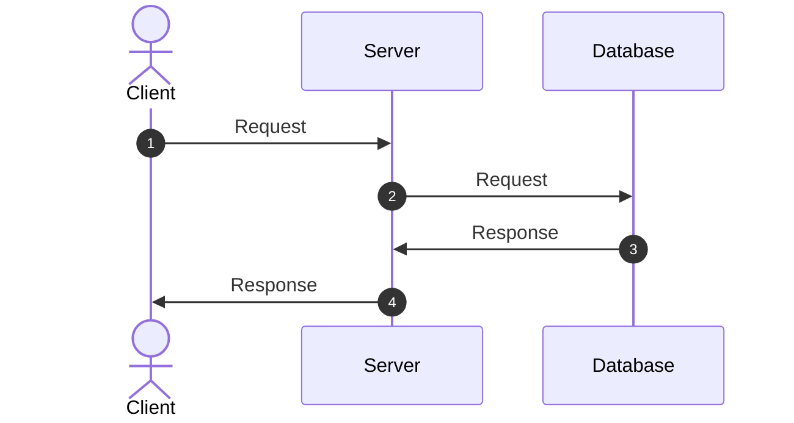

# {Project Name}

## Overview

This project provides a comprehensive template for utility applications with integrated development container support, GitHub issue templates, and automated workflow configurations. It includes pre-configured development environments, standardized issue reporting templates, and essential project structure for rapid development setup.

## Main Logic

## Architecture



## Directory Structure

## Environment Variables

|Name|Description|Required|Default|
|---|---|---|---|
|`EXAMPLE_VARIABLE`|Environmental Variable Example|〇|-|

## 初回セットアップ（環境構築）

### 前提条件

- [Dev Containers](https://containers.dev/)の拡張機能をインストールしていること
- UNIX/Linux系のOSであること ※ Windowsの場合はWSL2を利用推奨

### 1. リポジトリをクローンする

```bash
git clone <repo-url> <project-name>
cd <project-name>
```

### 2. プロジェクトを初期化する

```bash
chmod +x ./bin/setup-container.sh
./bin/setup-container.sh
```

### 3. Dev Containersを起動する

1. VSCodeで「^P」を押してコマンドパレットを開く

2. 検索窓に「> `Dev Containers: Open Folder in Container`」と入力する

3. 表示された候補を選択して実行（Dev Containers起動）

以降の手順はDev Containers内で行う。

### 3. 開発環境でアプリケーションを起動する

```bash
cd ./app/
docker compose up
```

### 4. アプリケーションにアクセスする

ブラウザで以下のURLにアクセス:
- **アプリケーション**: http://localhost:3000
