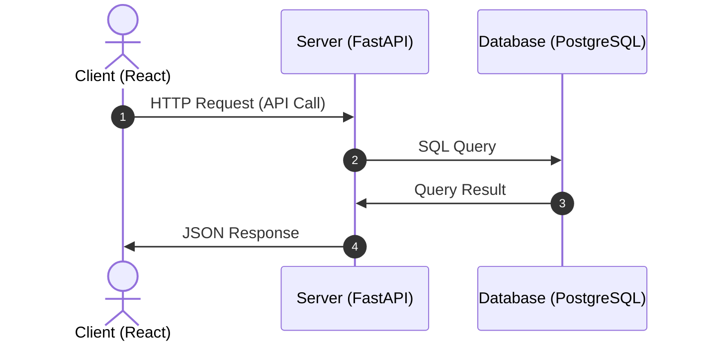

# Template Utils

## Overview

A comprehensive project template that provides a ready-to-use development environment with modern tooling and best practices. This template accelerates project setup by including pre-configured development containers, GitHub workflows, and standardized templates for issues and pull requests.

## Features

-

## Architecture



## Directory Structure

```
.
├── .devcontainer/                # Development container configuration
├── .github/                      # GitHub configuration
│   ├── ISSUE_TEMPLATE/           # GitHub issue templates
│   └── PULL_REQUEST_TEMPLATE/    # GitHub PR templates
├── .vscode/                      # VSCode configuration
├── app/                          # Application source code
│   ├── sample_go/                # Go application sample
│   └── sample_py/                # Python application sample
├── bin/                          # Utility scripts
└── docs/                         # Project documentation
```

## Getting Started

### Prerequisites

- [Docker](https://www.docker.com/)
- [Dev Containers](https://containers.dev/) extension (`anysphere.remote-containers`) for VSCode
- UNIX/Linux-based OS (Windows users should use WSL2)

### Quick Start

1. **Clone the repository**
   ```bash
   git clone <repo-url> <project-name>
   cd <project-name>
   ```

2. **Initialize the project**
   ```bash
   make init
   ```

3. **Open in Dev Container**
   - Press `Ctrl+Shift+P` (or `Cmd+Shift+P` on Mac) in VSCode
   - Type `Dev Containers: Open Folder in Container`
   - Select and execute the command

4. **Start the development environment**
   ```bash
   make up
   ```

5. **Access your application**
   - Open your browser and navigate to: http://localhost:3000
