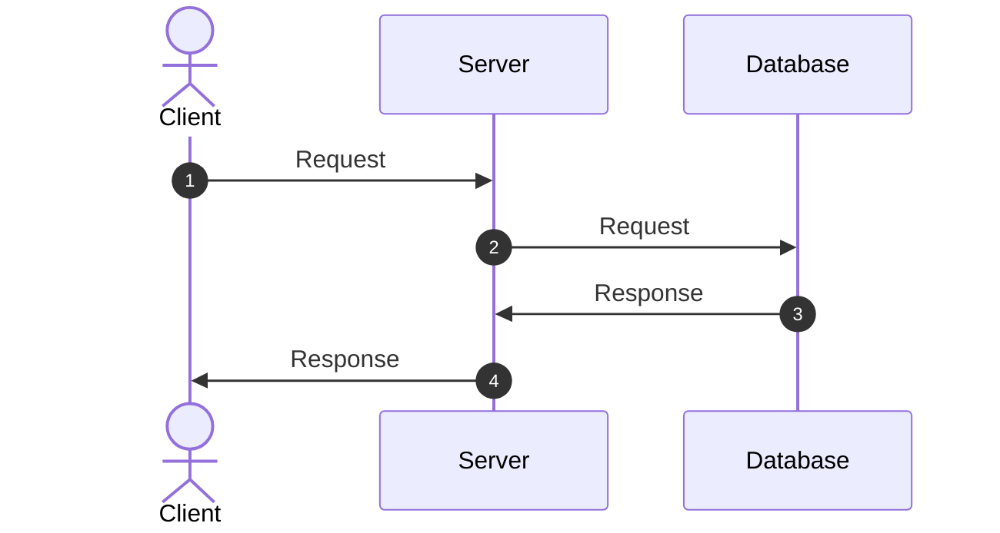

# {Project Name}

## Overview

This project provides a comprehensive template for utility applications with integrated development container support, GitHub issue templates, and automated workflow configurations. It includes pre-configured development environments, standardized issue reporting templates, and essential project structure for rapid development setup.

## Main Logic

## Architecture



## Directory Structure

## Environment Variables

|Name|Description|Required|Default|
|---|---|---|---|
|`EXAMPLE_VARIABLE`|Environmental Variable Example|〇|-|

## Initial Setup (Environment Configuration)

### Prerequisites

- [Docker](https://www.docker.com/) must be installed
- [Dev Containers](https://containers.dev/) extension (`anysphere.remote-containers`) must be installed
- UNIX/Linux-based OS (For Windows, WSL2 is recommended)

### 1. Clone the Repository

```bash
git clone <repo-url> <project-name>
cd <project-name>
```

### 2. Initialize the Project

```bash
make init
```

### 3. Launch Dev Containers

1. Press `^P` in VSCode to open the command palette

2. Type `> Dev Containers: Open Folder in Container` in the search box

3. Select and execute the displayed option (Launch Dev Containers)

Perform the following steps inside the Dev Container.

### 4. Start the Application in Development Environment

```bash
make up
```

### 5. Access the Application

Access the following URL in your browser:
- **Application**: http://localhost:3000
