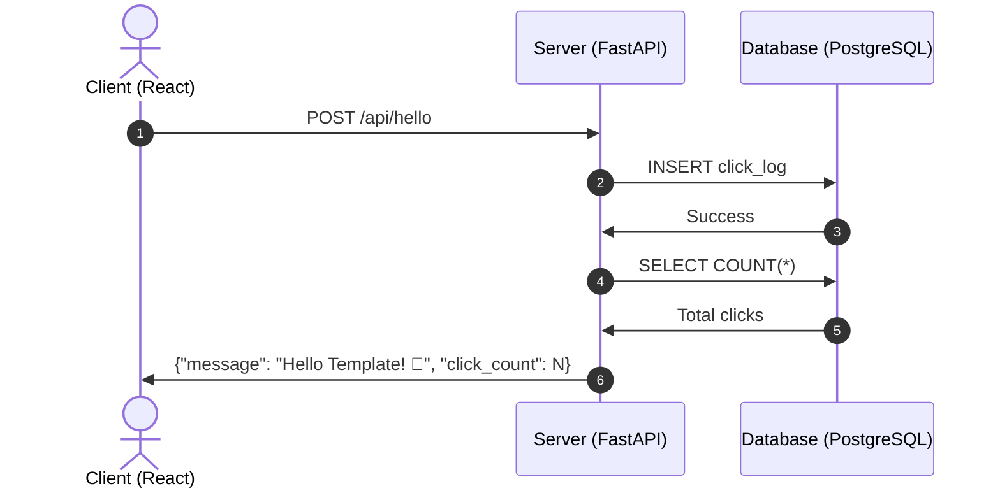

# Template Utils - Hello Template App

React + Python (FastAPI) + PostgreSQL を使用したシンプルなサンプルアプリケーションです。

## 🎯 アプリケーション概要

このサンプルアプリケーションは、ボタンを押下すると「Hello Template」と表示されるシンプルなWebアプリケーションです。ボタンのクリック数はPostgreSQLデータベースに保存され、Client-Server-Database の3層アーキテクチャを完全に実装しています。

### 技術スタック

- **フロントエンド**: React 18 + Axios
- **バックエンド**: Python 3.11 + FastAPI + SQLAlchemy
- **データベース**: PostgreSQL 16
- **コンテナ**: Docker + Docker Compose

### 主な機能

- 🎯 **シンプルなボタン**: クリックで「Hello Template」メッセージを表示
- 📊 **クリック数カウント**: データベースにクリック履歴を保存・表示
- 🏗️ **3層アーキテクチャ**: Client → Server → Database の完全な連携

## 🚀 クイックスタート

### 前提条件

- Docker
- Docker Compose

### アプリケーションの起動

1. **プロジェクトディレクトリに移動**
   ```bash
   cd /workspaces/template.utils/app
   ```

2. **Docker Composeでサービスを起動**
   ```bash
   docker-compose up --build
   ```

3. **アプリケーションにアクセス**
   - フロントエンド: http://localhost:3000
   - バックエンドAPI: http://localhost:8000
   - API ドキュメント: http://localhost:8000/docs

### サービスの停止

```bash
docker-compose down
```

## 🏗️ アーキテクチャ



## 📁 プロジェクト構造

```
app/
├── client/                    # Reactクライアントアプリケーション
│   ├── public/
│   │   └── index.html         # HTMLテンプレート
│   ├── src/
│   │   ├── App.js            # メインアプリケーション（ボタンとロジック）
│   │   ├── App.css           # アプリケーションスタイル
│   │   ├── index.js          # エントリーポイント
│   │   └── index.css         # グローバルスタイル
│   ├── package.json          # Node.js依存関係
│   └── Dockerfile            # クライアント用Dockerfile
├── server/                    # Python FastAPIサーバー
│   ├── src/
│   │   └── main.py           # FastAPIアプリケーション
│   ├── requirements.txt      # Python依存関係
│   └── Dockerfile            # サーバー用Dockerfile
├── docker-compose.yml        # Docker Compose設定
└── README.md                 # このファイル
```

## 🔌 API エンドポイント

### Hello Template API

- `POST /api/hello` - ボタンクリックを記録し、メッセージとクリック数を返す
  ```json
  {
    "message": "Hello Template! 🎉",
    "click_count": 1
  }
  ```

- `GET /api/stats` - クリック統計を取得
  ```json
  {
    "total_clicks": 1,
    "latest_click": "2025-09-14T21:18:08.269653"
  }
  ```

### その他のエンドポイント

- `GET /` - API情報
- `GET /health` - ヘルスチェック
- `GET /docs` - Swagger UI (API ドキュメント)

## 🗄️ データベーススキーマ

### click_logs テーブル

| カラム名 | データ型 | 制約 | 説明 |
|----------|----------|------|------|
| id | INTEGER | PRIMARY KEY | クリックID |
| clicked_at | TIMESTAMP | DEFAULT NOW() | クリック日時 |

## 🎮 使用方法

1. **ブラウザでアクセス**: http://localhost:3000
2. **「Click Me!」ボタンをクリック**:
   - 「Hello Template! 🎉」メッセージが表示される
   - クリック数がカウントアップされる
   - データベースにクリック履歴が保存される
3. **リアルタイム更新**: ページを再読み込みしてもクリック数が保持される

## 🛠️ 開発環境

### ローカル開発

各サービスを個別に起動することも可能です：

```bash
# データベースのみ起動
docker-compose up sample_db

# サーバーをローカルで起動
cd server
pip install -r requirements.txt
uvicorn src.main:app --reload --host 0.0.0.0 --port 8000

# クライアントをローカルで起動
cd client
npm install
npm start
```

### ログの確認

```bash
# 全サービスのログを確認
docker-compose logs

# 特定のサービスのログを確認
docker-compose logs client
docker-compose logs server
docker-compose logs sample_db
```

## 🔧 トラブルシューティング

### よくある問題

1. **ポートが既に使用されている場合**
   ```bash
   # 使用中のポートを確認
   lsof -i :3000
   lsof -i :8000
   lsof -i :5432
   ```

2. **データベース接続エラー**
   ```bash
   # データベースの状態を確認
   docker-compose exec sample_db pg_isready -U postgres
   ```

3. **依存関係のエラー**
   ```bash
   # コンテナを再ビルド
   docker-compose up --build --force-recreate
   ```

4. **データをリセットしたい場合**
   ```bash
   # ボリュームも含めて完全削除
   docker-compose down -v
   docker-compose up --build
   ```

## 🎯 アーキテクチャのポイント

このアプリケーションは、シンプルな機能でありながら、本格的なWebアプリケーションの3層アーキテクチャを完全に実装しています：

1. **プレゼンテーション層 (Client)**: React による UI とユーザーインタラクション
2. **アプリケーション層 (Server)**: FastAPI による ビジネスロジックとAPI提供
3. **データ層 (Database)**: PostgreSQL によるデータ永続化

この構成により、スケーラブルで保守性の高いアプリケーション開発の基礎を学ぶことができます。

## 📝 ライセンス

このプロジェクトはサンプル用途のため、自由に使用・改変してください。
