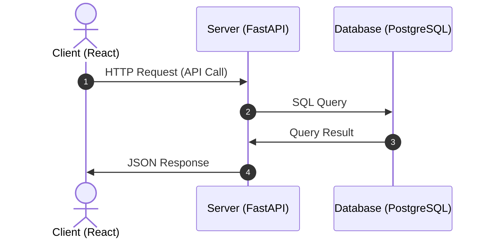

# Template Utils - Client-Server Sample Application

React + Python (FastAPI) + PostgreSQL を使用したサンプルアプリケーションです。

## 📋 アプリケーション概要

このサンプルアプリケーションは、タスク管理機能を提供するシンプルなWebアプリケーションです。

### 技術スタック

- **フロントエンド**: React 18 + Axios
- **バックエンド**: Python 3.11 + FastAPI + SQLAlchemy
- **データベース**: PostgreSQL 16
- **コンテナ**: Docker + Docker Compose

### 主な機能

- ✅ タスクの作成
- 📋 タスク一覧表示
- 🗑️ タスクの削除
- 📝 タスクの詳細表示
- 🔄 リアルタイムデータ同期

## 🚀 クイックスタート

### 前提条件

- Docker
- Docker Compose

### アプリケーションの起動

1. **プロジェクトディレクトリに移動**
   ```bash
   cd /workspaces/template.utils/app
   ```

2. **Docker Composeでサービスを起動**
   ```bash
   docker-compose up --build
   ```

3. **アプリケーションにアクセス**
   - フロントエンド: http://localhost:3000
   - バックエンドAPI: http://localhost:8000
   - API ドキュメント: http://localhost:8000/docs

### サービスの停止

```bash
docker-compose down
```

## 🏗️ アーキテクチャ



## 📁 プロジェクト構造

```
app/
├── client/                    # Reactクライアントアプリケーション
│   ├── public/
│   │   └── index.html
│   ├── src/
│   │   ├── App.js            # メインアプリケーションコンポーネント
│   │   ├── App.css           # スタイルシート
│   │   ├── index.js          # エントリーポイント
│   │   └── index.css         # グローバルスタイル
│   ├── package.json          # Node.js依存関係
│   └── Dockerfile            # クライアント用Dockerfile
├── server/                    # Python FastAPIサーバー
│   ├── src/
│   │   └── main.py           # FastAPIアプリケーション
│   ├── requirements.txt      # Python依存関係
│   └── Dockerfile            # サーバー用Dockerfile
├── docker-compose.yml        # Docker Compose設定
└── README.md                 # このファイル
```

## 🔌 API エンドポイント

### タスク管理API

- `GET /api/tasks` - タスク一覧取得
- `POST /api/tasks` - 新しいタスクを作成
- `GET /api/tasks/{task_id}` - 特定のタスクを取得
- `PUT /api/tasks/{task_id}` - タスクを更新
- `DELETE /api/tasks/{task_id}` - タスクを削除

### その他のエンドポイント

- `GET /` - API情報
- `GET /health` - ヘルスチェック
- `GET /docs` - Swagger UI (API ドキュメント)

## 🗄️ データベーススキーマ

### tasks テーブル

| カラム名 | データ型 | 制約 | 説明 |
|----------|----------|------|------|
| id | INTEGER | PRIMARY KEY | タスクID |
| title | VARCHAR(200) | NOT NULL | タスクタイトル |
| description | TEXT | NULL | タスク説明 |
| created_at | TIMESTAMP | DEFAULT NOW() | 作成日時 |

## 🛠️ 開発環境

### ローカル開発

各サービスを個別に起動することも可能です：

```bash
# データベースのみ起動
docker-compose up sample_db

# サーバーをローカルで起動
cd server
pip install -r requirements.txt
uvicorn src.main:app --reload --host 0.0.0.0 --port 8000

# クライアントをローカルで起動
cd client
npm install
npm start
```

### ログの確認

```bash
# 全サービスのログを確認
docker-compose logs

# 特定のサービスのログを確認
docker-compose logs client
docker-compose logs server
docker-compose logs sample_db
```

## 🔧 トラブルシューティング

### よくある問題

1. **ポートが既に使用されている場合**
   ```bash
   # 使用中のポートを確認
   lsof -i :3000
   lsof -i :8000
   lsof -i :5432
   ```

2. **データベース接続エラー**
   ```bash
   # データベースの状態を確認
   docker-compose exec sample_db pg_isready -U postgres
   ```

3. **依存関係のエラー**
   ```bash
   # コンテナを再ビルド
   docker-compose up --build --force-recreate
   ```

## 📝 ライセンス

このプロジェクトはサンプル用途のため、自由に使用・改変してください。
