# Template Utils - Hello Template App

A simple sample application using React + Python (FastAPI) + PostgreSQL.

## 🎯 Application Overview

This sample application is a simple web application that displays "Hello Template" when a button is pressed. The button click count is stored in a PostgreSQL database, fully implementing a 3-tier Client-Server-Database architecture.

### Technology Stack

- **Frontend**: React 18 + Axios
- **Backend**: Python 3.11 + FastAPI + SQLAlchemy
- **Database**: PostgreSQL 16
- **Container**: Docker + Docker Compose

### Main Features

- 🎯 **Simple Button**: Click to display "Hello Template" message
- 📊 **Click Counter**: Save and display click history in database
- 🏗️ **3-Tier Architecture**: Complete integration of Client → Server → Database

## 🚀 Quick Start

### Prerequisites

- Docker
- Docker Compose

### Starting the Application

1. **Navigate to project directory**
   ```bash
   cd /workspaces/template.utils/app
   ```

2. **Start services with Docker Compose**
   ```bash
   docker-compose up --build
   ```

3. **Access the application**
   - Frontend: http://localhost:3000
   - Backend API: http://localhost:8000
   - API Documentation: http://localhost:8000/docs

### Stopping Services

```bash
docker-compose down
```

## 🏗️ Architecture

```mermaid
sequenceDiagram
    autonumber
    actor CL as Client (React)
    participant SV as Server (FastAPI)
    participant DB as Database (PostgreSQL)
    CL->>SV: POST /api/hello
    SV->>DB: INSERT click_log
    DB->>SV: Success
    SV->>DB: SELECT COUNT(*)
    DB->>SV: Total clicks
    SV->>CL: {"message": "Hello Template! 🎉", "click_count": N}
```



## 📁 Project Structure

```
app/
├── client/                    # React client application
│   ├── public/
│   │   └── index.html         # HTML template
│   ├── src/
│   │   ├── App.js            # Main application (button and logic)
│   │   ├── App.css           # Application styles
│   │   ├── index.js          # Entry point
│   │   └── index.css         # Global styles
│   ├── package.json          # Node.js dependencies
│   └── Dockerfile            # Client Dockerfile
├── server/                    # Python FastAPI server
│   ├── src/
│   │   └── main.py           # FastAPI application
│   ├── requirements.txt      # Python dependencies
│   └── Dockerfile            # Server Dockerfile
├── docker-compose.yml        # Docker Compose configuration
└── README.md                 # This file
```

## 🔌 API Endpoints

### Hello Template API

- `POST /api/hello` - Record button click and return message with click count
  ```json
  {
    "message": "Hello Template! 🎉",
    "click_count": 1
  }
  ```

- `GET /api/stats` - Get click statistics
  ```json
  {
    "total_clicks": 1,
    "latest_click": "2025-09-14T21:18:08.269653"
  }
  ```

### Other Endpoints

- `GET /` - API information
- `GET /health` - Health check
- `GET /docs` - Swagger UI (API documentation)

## 🗄️ Database Schema

### click_logs Table

| Column | Data Type | Constraint | Description |
|--------|-----------|------------|-------------|
| id | INTEGER | PRIMARY KEY | Click ID |
| clicked_at | TIMESTAMP | DEFAULT NOW() | Click timestamp |

## 🎮 Usage

1. **Access via browser**: http://localhost:3000
2. **Click the "Click Me!" button**:
   - "Hello Template! 🎉" message is displayed
   - Click count increments
   - Click history is saved to database
3. **Real-time updates**: Click count persists even after page reload

## 🛠️ Development Environment

### Local Development

You can also start each service individually:

```bash
# Start database only
docker-compose up db

# Start server locally
cd server
pip install -r requirements.txt
uvicorn src.main:app --reload --host 0.0.0.0 --port 8000

# Start client locally
cd client
npm install
npm start
```

### Viewing Logs

```bash
# View logs for all services
docker-compose logs

# View logs for specific service
docker-compose logs client
docker-compose logs server
docker-compose logs db
```

## 🔧 Troubleshooting

### Common Issues

1. **Port already in use**
   ```bash
   # Check ports in use
   lsof -i :3000
   lsof -i :8000
   lsof -i :5432
   ```

2. **Database connection error**
   ```bash
   # Check database status
   docker-compose exec db pg_isready -U postgres
   ```

3. **Dependency errors**
   ```bash
   # Rebuild containers
   docker-compose up --build --force-recreate
   ```

4. **Reset data**
   ```bash
   # Complete removal including volumes
   docker-compose down -v
   docker-compose up --build
   ```

## 🎯 Architecture Highlights

This application, while simple in functionality, fully implements a professional 3-tier web application architecture:

1. **Presentation Layer (Client)**: React UI and user interactions
2. **Application Layer (Server)**: FastAPI business logic and API provision
3. **Data Layer (Database)**: PostgreSQL data persistence

This structure allows you to learn the fundamentals of scalable and maintainable application development.

## 📝 License

This project is for sample purposes and is free to use and modify.
